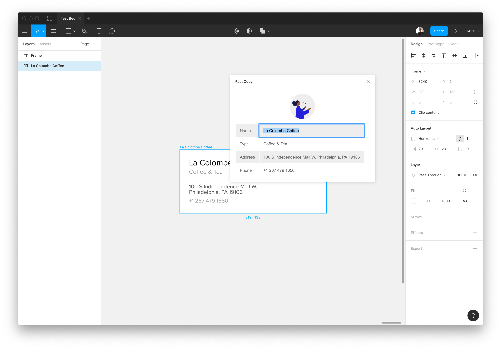

# Figma Fast Text Copy

This is a Figma Plugin that's designed to allow people to retrieve all the text from a selected frame. It allows people to simply select the text from the table and it automatically copies the text to the clipboard.

## Running

```
npm install
npx webpack --mode=development --watch
```